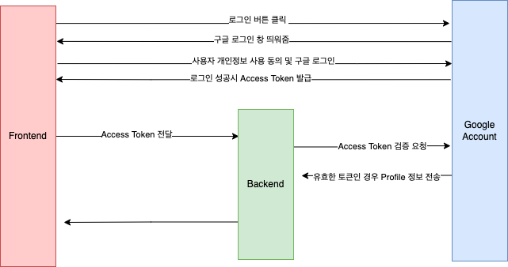

# Google Login
## 요구사항

- Frontend/ Backend 서버 분리
- 회원가입 도중에 그만두면 DB에 저장 안되도록 하기
- 기존에 동일한 email이 DB에 있는경우 회원가입이 아니라 로그인 되도록 하기
- Oauth의 Client Secret Key 등 민감정보는 BE가 가지고 있도록 하기

# 로그인 프로세스

1. 구글 로그인 버튼 클릭
2. 구글 서버로부터 Access token을 받는다.
3. 서버로 Access token 정보를 담은 HTTP 요청
4. 서버에서 유저 정보 응답
    1. AccessToken으로 profile 가져옴
    2. email을 기준으로 기존에 회원가입 되어있는 유저인지 확인
    3. 응답
        1. 신규 회원인 경우 : email, name, picture 를 리턴해줌
        2. 기존 회원인 경우 : 로그인 JWT 토큰 리턴 (gateway에서)
5. 유저가 회원가입 페이지에서 입력한 닉네임, github url, blog url, 자기소개, 태그 정보 등을 포함하여 서버로 전송
6. 서버에서 DB에 저장


## 코드 설명

- 구글 signUp
    - 구글한테 프로필 받아서 모든 정보 입력 다 하면 함께 보내주기 ( /api/auth/signUp)
        - [코드 보러가기](https://github.com/dayoungMM/login-Oauth2/blob/main/src/main/java/com/moondy/loginoauth2/controller/AuthController.java)
        - 구글 로그인 (소셜 로그인 페이지로 리다이렉트 해주는 API)

            ```java
            @GetMapping("/auth/{socialLoginType}") //GOOGLE이 들어올 것이다.
                public void socialLoginRedirect(@PathVariable(name = "socialLoginType") String socialLoginPath) throws IOException {
                    SocialLoginType socialLoginType = SocialLoginType.valueOf(socialLoginPath.toUpperCase());
                    oAuthService.request(socialLoginType);
                }
            ```

        - 로그인 성공시 callback api로 code(access key) 들어오는데 이걸 받아서 Backend에게 로그인 시도

            ```java
            @GetMapping(value = "/auth/{socialLoginType}/callback")
                public String callback(
                        @PathVariable(name = "socialLoginType") String socialLoginPath,
                        @RequestParam(name = "code") String code,
                        RedirectAttributes re) throws IOException {
                    log.info(">> 소셜 로그인 API 서버로부터 받은 code :" + code);
                    SocialLoginType socialLoginType = SocialLoginType.valueOf(socialLoginPath.toUpperCase());
                    UserInfo userInfo = oAuthService.oAuthLogin(socialLoginType, code);
                    re.addAttribute("email", userInfo.getEmail());
                    re.addAttribute("username", userInfo.getUserName());
                    re.addAttribute("picture", userInfo.getPictureUrl());
                    return "redirect:/home";
                }
            ```

            - access key로 BE에게 이거 로그인 요청(/api/auth/oauth/google) → 코드에서는 oAuthService.oAuthLogin()
                - 신규 유저면 email, username, picuture 받음 → 회원가입 페이지로 이동
                - 성공하면 로그인 된걸로 간주하고 Authorization 토큰 response 받음


> 💡 굳이 BE에게 요청해서 email, username, pictureUrl 받아오는 이유
>1. 신규 유저인지 기존 유저인지 확인하려면 DB 까지 갔다와야해서
>2. FE에서 구글에 요청해서 email,username, pictureUrl 받아온 후 BE에게 로그인/회원가입 요청하면 BE입장에서 진짜 구글 로그인 한게 맞는지 믿을 수 없음 (보안 문제)


- 구글 signIn
    - /api/auth/oauth/google
    - 프로세스
        - 구글 로그인화면
        - 로그인 성공시 callback api로 access key 들어옴 (파싱 필요)
        - access key로 BE에게 이거 로그인 요청(/api/auth/oauth/google)
            - 실패하면 회원가입 페이지로 이동→ 회원가입 페이지로 이동
            - 성공하면 Authorization 토큰 response 받음